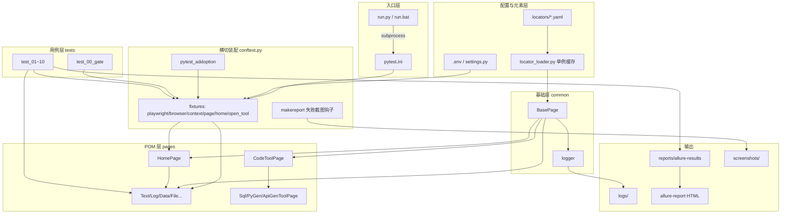
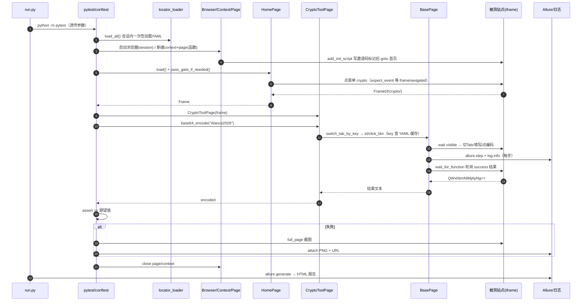
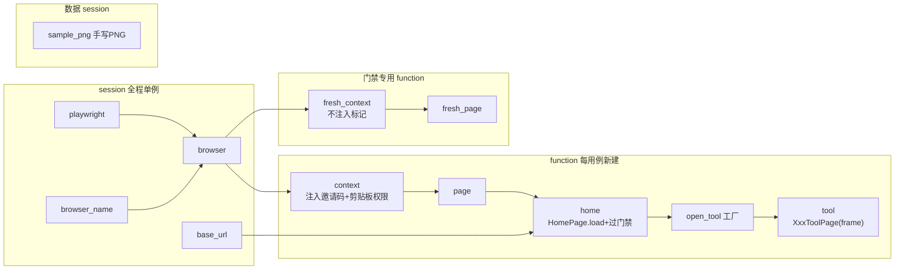
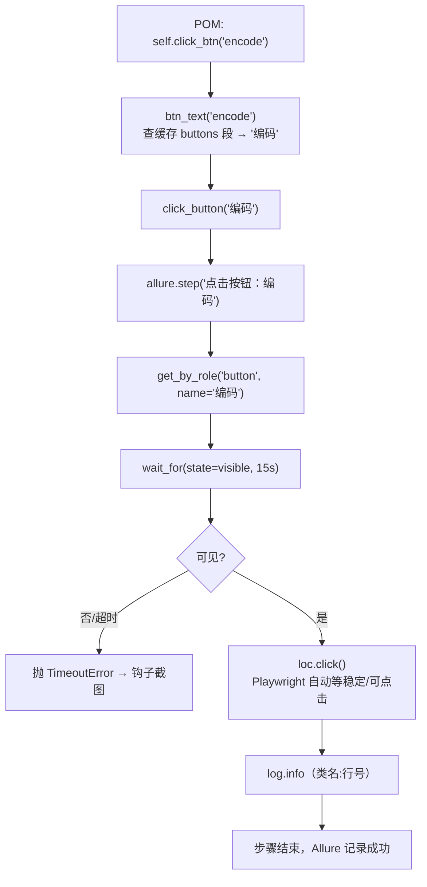
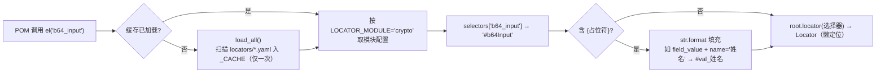

# 框架代码详解（工作原理与串联机制）

> 本文按项目**实际运转顺序**逐层讲解：一条命令敲下去后，配置如何加载、浏览器如何启动、
> 门禁如何通过、用例如何调用 POM、POM 如何经基类操作页面、日志如何落盘、
> Allure 报告如何生成。阅读本文后可独立维护与扩展本框架。

---

## 目录

1. [全景架构与五层模型](#一全景架构与五层模型)
2. [一次完整运行的生命周期](#二一次完整运行的生命周期)
3. [逐目录/逐文件代码讲解](#三逐目录逐文件代码讲解)
4. [核心串联链路：一条用例的完整调用栈](#四核心串联链路一条用例的完整调用栈)
5. [关键机制工作原理](#五关键机制工作原理)
6. [流程图合集（Mermaid）](#六流程图合集mermaid)

---

## 一、全景架构与五层模型

框架采用 **配置/元素 → 基础设施 → 页面对象（POM）→ 用例** 的单向依赖结构，
外层依赖内层，内层不感知外层：

```text
┌─────────────────────────────────────────────────────────────┐
│ 用例层 tests/                                                 │
│   只写业务语义 + 断言，通过 fixture 拿到 POM                    │
│   tool.base64_encode("Alance2026")  →  assert == "QWx..."    │
└───────────────▲─────────────────────────────────────────────┘
                │ 依赖（open_tool 工厂注入）
┌───────────────┴─────────────────────────────────────────────┐
│ 页面对象层 pages/ （12 个类）                                  │
│   HomePage：门禁 + 侧边栏 + iframe 管理                        │
│   XxxToolPage：每个菜单一个类，只表达“做什么”                   │
│   CodeToolPage：代码造数三菜单的公共父类                       │
└───────────────▲─────────────────────────────────────────────┘
                │ 继承
┌───────────────┴─────────────────────────────────────────────┐
│ 基础层 common/                                                │
│   BasePage     —— 定位/点击/填写/等待/Toast/截图（全部能力）    │
│   locator_loader —— YAML 元素仓库的单例缓存读取                │
│   logger        —— 控制台 + 按天文件双通道日志                 │
└───────────────▲─────────────────────────────────────────────┘
                │ 读取
┌───────────────┴─────────────────────────────────────────────┐
│ 配置层 + 元素仓库                                              │
│   config/settings.py  +  .env        环境参数（地址/码/浏览器） │
│   locators/*.yaml                    选择器/Tab/按钮文案       │
└─────────────────────────────────────────────────────────────┘

           横切：conftest.py（pytest fixture 与钩子，贯穿全部层）
           横切：run.py / pytest.ini（启动入口与运行规则）
```

**数据流向**：`.env/YAML` → `settings/locator_loader` → `conftest` 启动浏览器 →
`HomePage` 过门禁开 iframe → `XxxToolPage`（经 `BasePage`）操作页面 →
结果回流用例断言；全过程日志落盘，Allure 记录步骤，失败自动截图。

---

## 二、一次完整运行的生命周期

以 `python run.py` 为例，时间线如下：

| 阶段 | 执行者 | 发生了什么 |
|---|---|---|
| ① 启动 | `run.py` | 解析 `--serve/--headed` 等内置参数，其余透传，`subprocess` 调起 `python -m pytest` |
| ② 加载配置 | `config/settings.py`（import 即执行） | 定根目录 → 固定浏览器路径 → `load_dotenv()` 覆盖默认值 → 自动建 data/logs/reports 目录 |
| ③ 收集 | pytest + `conftest.py` | 执行 `pytest_addoption` 注册 `--browser-name/--headed/...`；按 `pytest.ini` 的 `testpaths=tests` 收集 62 条用例 |
| ④ 会话级准备 | session fixture | `_preload_locators` **一次性**加载全部 YAML；启动 1 个 Playwright 进程和 1 个浏览器；写 Allure environment.properties |
| ⑤ 函数级准备 | function fixture | 每条用例新建 BrowserContext（注入邀请码 sessionStorage）→ 新建 Page → `HomePage.load()` 打开首页过门禁 → 点菜单等 iframe → 实例化对应 `XxxToolPage` |
| ⑥ 执行用例 | 用例 → POM → BasePage | 业务方法经基类完成"切 Tab/填写/点击/智能等待"，每步自动写日志 + Allure.step |
| ⑦ 结果处理 | `pytest_runtest_makereport` 钩子 | 失败则全页截图（Allure 附件 + 落盘）并记录当前 URL |
| ⑧ 清理 | fixture teardown | 关 Page、关 Context（cookie/sessionStorage 天然隔离） |
| ⑨ 会话结束 | session fixture teardown | 关浏览器、关 Playwright 进程 |
| ⑩ 出报告 | `run.py` | `allure generate reports/allure-results -o reports/allure-report`（无 CLI 则降级提示） |

---

## 三、逐目录/逐文件代码讲解

### 3.1 启动入口层

#### `run.py` —— 一键入口（薄封装）

- `run_pytest(extra_args)`：拼出 `[sys.executable, "-m", "pytest", *参数]` 用
  `subprocess.call` 执行。用 `sys.executable` 保证调用的是**当前 venv 的解释器**，
  避免环境串用。
- `generate_allure_report(serve)`：`shutil.which("allure")` 探测 Allure CLI；
  有则 `allure generate/serve`，无则只打印 `allure serve` 提示——**不因没装报告工具导致主流程失败**。
- 设计要点：run.py 不 import 任何测试代码，只做"调 pytest + 出报告"两件事，
  所有 pytest 参数（`-m menu1`、`-k xxx`、`tests/test_07.py`）原样透传。

#### `run.bat` —— Windows 入口，自动识别 `.\.venv\Scripts\python.exe` 后调用 run.py。

#### `pytest.ini` —— pytest 运行规则

- `testpaths=tests`：只收集 tests 目录；
- `addopts=--alluredir=reports/allure-results --clean-alluredir`：
  每次运行把 Allure 原始 JSON 写到固定目录，`--clean` 保证不与历史结果混杂；
- `markers`：注册 `smoke/menu1~menu10`，支持 `-m menu7` 按菜单筛选，
  未注册的 mark 在新版 pytest 会告警；
- `log_file=logs/pytest.log`：这是 **pytest 自己**的日志通道，与框架业务日志
  （`auto_ui_YYYYMMDD.log`）分离。

### 3.2 配置层 `config/settings.py`

模块在**第一次被 import 时**自上而下执行，是整个框架最早运行的业务代码：

1. **路径锚定**：`ROOT_PATH = Path(__file__).resolve().parent.parent`
   —— 以文件自身位置反推项目根，换机器/换盘符无需改代码；其余目录（DATA_DIR、
   LOG_DIR、REPORTS_DIR、LOCATORS_DIR…）全部由它用 `/` 拼接派生。
2. **浏览器路径固定**：`os.environ.setdefault("PLAYWRIGHT_BROWSERS_PATH", ...)`
   —— 把浏览器目录指到项目内 `.ms-playwright`，须在 `import playwright` **之前**
   执行；`setdefault` 表示尊重外部已设的环境变量（外部优先）。
3. **环境覆盖**：`load_dotenv(ROOT_PATH/".env")` 把 `.env` 注入 `os.environ`，
   文件不存在静默跳过。
4. **目录兜底**：对 data/logs/reports 等 5 个目录 `mkdir(parents=True, exist_ok=True)`，
   保证开箱即跑，后续模块无需判空。
5. **配置取值**：`BASE_URL/INVITE_CODE/BROWSER/SLOW_MO` 用 `os.getenv(key, 默认值)`，
   布尔型走私有函数 `_get_bool`（兼容 true/1/yes/on 及大小写空格）。

优先级链：**命令行参数（conftest 覆盖） > 系统环境变量/.env > 代码默认值**。

此外 `MENUS` 维护 10 个菜单 data-key 与中文名映射，`INVITE_STORAGE_KEY`
是前端约定的 sessionStorage 标记名。

### 3.3 元素仓库层 `locators/` + `common/locator_loader.py`

#### YAML 文件组织（一模块一文件）

| 文件 | 内容 |
|---|---|
| `common.yaml` | 跨页骨架：`.tabs .tab`、`.tab-content.active`、按 value 的单/复选框、`pre.code-box` |
| `home.yaml` | 门禁（`.gate/#inviteCode/#gateError`）、菜单（`.menu-item[data-key='{key}']`）、`#toolFrame` |
| `text.yaml … crypto.yaml` | 菜单 01~07 的 tabs/buttons/selectors 及业务枚举段 |
| `sql/pygen/apigen.yaml` | 菜单 08~10（代码造数类，只需 tabs + copy_code 按钮） |

每个文件分标准段：

```yaml
tabs:        { 业务key: 页面Tab文案 }      # 如 json_compare: "JSON对比"
buttons:     { 业务key: 按钮可见文本 }      # 如 start_compare: "开始对比"
selectors:   { 业务key: CSS选择器 }         # 支持 {占位符}，如 field_value: "#val_{name}"
stat_ids:    { 元素id: 指标名 }             # 自定义枚举段，名称按需扩展
```

#### `locator_loader.py` —— 单例缓存读取器

- 模块级 `_CACHE: dict` 与 `_loaded: bool` 是进程内**单例状态**；
- `load_all(force=False)`：扫描 `locators/*.yaml`，`yaml.safe_load` 后按
  文件名（stem）存入 `_CACHE`，置 `_loaded=True`。之后再调用直接返回缓存，
  **整个测试运行只读盘一次**；
- 读取 API：
  - `selector(module, key, **kwargs)`：取选择器并用 `str.format` 填充
    `{占位符}`（如 `key="text"` → `.menu-item[data-key='text']`）；
  - `tab/button(module, name)`：取文案；
  - `section(module, 段名)`：取自定义枚举 dict（log 的统计 id、data 的字符集）；
  - `ordered_values(module, 段名)`：按 YAML 书写顺序取值（Tab 顺序敏感）；
- `_ensure_loaded()` 惰性兜底：即使没有预热，第一次读取也会自动加载；
- key 不存在时抛带文件名提示的 `KeyError`，方便定位 YAML 笔误。

预热动作在 conftest 的 session 级 autouse fixture `_preload_locators` 中显式完成，
启动日志可见 `YAML 元素仓库加载完成：12 个模块`。

### 3.4 横切核心 `conftest.py` —— fixture 依赖网与钩子

conftest 是 pytest 的"装配车间"，所有用例不自己开浏览器，而是声明参数由它注入。

#### 命令行参数

`pytest_addoption` 注册 4 个参数，默认值取自 settings，实现命令行最高优先级覆盖。

#### fixture 分层（作用域决定生命周期）

```text
session 级（全程一份）
  playwright          sync_playwright() 进程上下文，yield 后退出
  browser             launch 一个浏览器（headless 由 HEADLESS 与 --headed 共同决定）
  browser_name/base_url  读取命令行参数（base_url 会规范化结尾斜杠）

function 级（每条用例一套，天然隔离）
  context             new_context：固定视口 1600x900、zh-CN、剪贴板权限；
                      add_init_script 预置 sessionStorage 邀请码标记
  page                context.new_page()，teardown 关闭
  home                HomePage(page, base_url).load() + pass_gate_if_needed()
  open_tool           工厂函数：home.open_tool(key) → 拿 Frame → page_cls(frame)
  tool（在各 test 文件中） open_tool("crypto", CryptoToolPage)

门禁专用（不注入标记）
  fresh_context / fresh_page  干净会话，供 test_00 验证真实首次门禁
```

关键设计：

- **为什么 context 是函数级**：cookie/localStorage/sessionStorage 随 context 生灭，
  用例间零污染；浏览器只开一个（session 级），兼顾隔离与速度。
- **邀请码免重复输入**：`add_init_script` 在**每个新文档加载前**执行
  `sessionStorage.setItem('alance_invite_passed','1')`，页面 JS 读到标记即不弹门禁；
  门禁本身仍由 test_00 用 `fresh_page` 专项覆盖。
- **`open_tool` 工厂**：把"点菜单 + 等 iframe + 实例化 POM"收敛成一行，
  10 个测试文件的 `tool` fixture 写法完全一致，只换 key 和类。
- **`sample_png`（session 级）**：用标准库 `zlib+struct` 手写 120x80 合法 PNG
  （IHDR/IDAT/IEND + CRC），避免引入 Pillow。

#### 钩子：失败自动截图

`pytest_runtest_makereport` 用 `@hookimpl(hookwrapper=True)` 包住每个用例的
setup/call/teardown：仅在 setup 或 call 失败时，从 `item.funcargs` 取 page/fresh_page，
`full_page=True` 截图后做两件事——`allure.attach` 挂进报告附件、落盘
`reports/screenshots/<用例名>.png`，并把当前 URL 作为文本附件。

#### 会话环境信息

autouse 的 `_write_allure_environment` 写 `environment.properties`，
报告首页展示 Browser/BaseURL/Headless/Platform。

### 3.5 基础层 `common/`

#### `logger.py` —— 双通道日志

`get_logger(name)` 返回标准库 Logger：

- 首次调用挂两个 handler：按天文件 `logs/auto_ui_YYYYMMDD.log`（UTF-8）+ 控制台，
  格式 `时间 | 级别 | 名称:行号 | 消息`；
- `if logger.handlers: return logger` 防止同名 logger 重复挂 handler；
- `logger.propagate = False` 阻止向 root（pytest 的 handler）冒泡，
  避免同一条日志在两个文件重复；
- 名字在 BasePage 中传 `self.__class__.__name__`，所以日志直接显示
  `CryptoToolPage:21` 这样的来源类名，多页面排查一目了然。

#### `base_page.py` —— POM 基石（最重要的类）

`BasePage` 同时兼容 `Page`（主页）与 `Frame`（工具 iframe）——两者都有
`locator/evaluate/wait_for_function` 等同一套 API，故用类型别名
`PageLike = Union[Page, Frame]` 统一 `self.root`。

构造时装配三件套：`self.root`（操作作用域）、`self.log`（子类名日志器）、
`self.default_timeout`（全局超时 15s）；子类声明 `LOCATOR_MODULE` 绑定 YAML 模块。

能力分五组：

1. **YAML 定位组**：`el(key, **kwargs)`（→Locator）、`sel(key)`（→选择器串）、
   `id_of(key)`（去 `#` 供 id 类等待 API 使用）、`common_sel(key)`（读 common.yaml）、
   `tab_text/btn_text`（读文案）。
2. **语义化交互组**：`fill_el/select_el/upload_el/click_btn/switch_tab_by_key/
   wait_el_visible`——用例和 POM 只传 YAML key，不出现选择器字面量。
3. **原始交互组**：`click/fill/select_option/check/uncheck/set_input_files`，
   入参既支持 Locator 也支持选择器字符串（`isinstance` 判断）。
   每个方法统一模式：`with allure.step(...): wait_for(visible) → 动作 → log.info`。
4. **读取与智能等待组**：
   - `wait_result_success(id, not_equals=)`：`wait_for_function` 轮询结果区
     "可见 + class 含 success + 文本非空 + 不等于旧值"，兼容站点两种成功态 class；
   - `wait_result_nonempty(id)`：针对不加 success class 的结果（JSON 美化）；
   - `wait_input_value(id, old)`：等异步 fetch 回填输入框（日志加载示例）；
   - `has_media_output(id)`：等 img/canvas/下载链接出现（图片类）。
5. **Toast 与截图组**：`click_get_toast` 先 `_arm_toast_recorder` 注入
   MutationObserver 监听 `#toast`（只存活约 2s，先埋伏再点击保证捕获），
   把文案存 `window.__toasts`；`screenshot()` 支持跨 iframe 全页截图。

### 3.6 页面对象层 `pages/`

#### `home_page.py` —— 平台首页（root 是 Page）

- 门禁三件套：`is_gate_visible()`（`.gate` 无 hidden 类即可见）、
  `enter_invite_code()`（填码 + 点"进 入"）、`pass_gate_if_needed()`
  （可见才输并等遮罩 hidden）；
- 菜单：`menu_locator(key)` 用模板选择器 `.menu-item[data-key='{key}']`；
- **iframe 竞态处理**（核心难点）：`open_tool(key)` 先看当前激活菜单，
  需要切换时用 `expect_event("framenavigated", predicate=URL匹配 /t/key/)`
  包住点击动作，从事件拿 Frame；已激活则走 `_wait_tool_frame`——查不到 frame
  就等一次 framenavigated 事件，解决首屏 iframe 处于 about:blank 的竞态。
  最后等 iframe 内 `h1` 可见，把 **Frame 对象**返回给工厂。

#### 10 个工具页（root 是 Frame）

以 `crypto_tool_page.py` 为例，每个方法都是"切 Tab（by key）→ 填/选（by key）→
点按钮（by key）→ 智能等待结果（by id）"的声明式流程，不含选择器细节。

继承体系：

```text
BasePage
 ├── HomePage
 ├── TextToolPage / LogToolPage / DataToolPage / FileToolPage
 ├── ConvertToolPage / ImageToolPage / CryptoToolPage
 └── CodeToolPage（抽象"多Tab+代码块+复制"通用流程：show_code/copy_code）
       ├── SqlToolPage     （声明 LOCATOR_MODULE、TABS、EXPECTED_KEYWORDS）
       ├── PyGenToolPage
       └── ApiGenToolPage
```

`TABS`、`ALL_TABS`、`CHAR_TYPES` 等类常量在类定义时即从 YAML 读取，
对用例层保持原有的类属性访问方式（`SqlToolPage.TABS`）。

### 3.7 用例层 `tests/`

- `test_00_gate.py` 用 `fresh_page` 验证门禁（可见/错误码拦截/正确码放行+写标记）；
- `test_01~10` 每个文件结构一致：模块级 `MENU_KEY` + 函数级 `tool` fixture +
  `@allure.epic/feature/story/title` 四级标注 + `@pytest.mark.menuN` 标记；
- 用例方法体只做两件事：**调 POM 业务方法**拿结果、**断言业务期望值**
  （标准已知值如 MD5("abc")、可逆性、Tab 列表、Toast 文案等）；
- 参数化用 `@pytest.mark.parametrize` 驱动多 Tab 回归（test_08/09/10）；
- 环境限制用 `pytest.skip` 优雅处理（服务端缺 pycryptodome 的 AES/RSA）。

### 3.8 输出物

| 产物 | 产生者 | 用途 |
|---|---|---|
| `logs/auto_ui_YYYYMMDD.log` | logger | 框架业务操作轨迹（按类名） |
| `logs/pytest.log` | pytest.ini | pytest 运行日志 |
| `reports/allure-results/*.json` | allure-pytest 插件 | 报告原始数据（步骤/状态/附件） |
| `reports/allure-report/index.html` | allure generate | 静态报告站点 |
| `reports/screenshots/*.png` | makereport 钩子 | 失败现场（同时挂报告附件） |
| `data/sample_120x80.png` | sample_png fixture | 图片类用例输入 |

---

## 四、核心串联链路：一条用例的完整调用栈

以 `test_base64_roundtrip` 为例，从参数注入到断言的完整链路：

```python
# tests/test_07_crypto.py
def test_base64_roundtrip(self, tool):
    encoded = tool.base64_encode("Alance2026")
    assert encoded == "QWxhbmNlMjAyNg=="
```

调用栈展开（编号即执行顺序）：

```text
[pytest 收集] conftest.pytest_addoption → 注册参数
[会话开始]   _preload_locators() → locator_loader.load_all() ① 全部YAML入缓存
             playwright() → browser()：启动唯一浏览器
[本条用例 setup]
  ② context()：new_context + add_init_script(邀请码标记) + 剪贴板权限
  ③ page()：new_page
  ④ home()：HomePage(page,url).load()
       → goto + el("menu_items") 等首页渲染
       → pass_gate_if_needed()：读 .gate 状态（标记已存在→跳过）
  ⑤ tool() → open_tool("crypto", CryptoToolPage)
       → home.open_tool("crypto")：
           active_menu_key() 判重 → expect_event(framenavigated) 包点击菜单
           → 等 iframe 内 h1 → 返回 Frame
       → CryptoToolPage(frame)                    # root = Frame
[用例执行]
  ⑥ tool.base64_encode("Alance2026")
       → switch_tab_by_key("base64")
            → tab_text("base64") 读 YAML 得 "Base64"  （命中缓存，无IO）
            → BasePage.switch_tab：tab("Base64") 定位→common.yaml 的 ".tabs .tab"
              → allure.step → 点击 → 等 .tab-content.active
       → fill_el("b64_input", ...)
            → el("b64_input")：selector() 读 YAML 得 "#b64Input" → frame.locator(...)
            → BasePage.fill：allure.step → wait_for(visible) → fill → log.info
       → click_btn("encode")
            → btn_text 读 YAML 得 "编码" → get_by_role("button", "编码") → click
       → wait_result_success(id_of("b64_result"))
            → wait_for_function 轮询：可见 + /success/ class + 文本非空
  ⑦ assert encoded == "QWxhbmNlMjAyNg=="          # 业务断言
[teardown] page.close() → context.close()          # 隔离状态销毁
[失败时]   makereport 钩子 → 全页截图 → Allure附件 + 落盘
[会话结束] browser.close()
[run.py]   allure generate → index.html
```

**串联三要素**：

1. **fixture 依赖注入**串起环境准备：`tool → open_tool → home → page → context →
   browser → playwright`，pytest 自动按依赖序实例化、按作用域销毁；
2. **继承**串起页面能力：`CryptoToolPage → BasePage`，业务方法只写流程，
   点击/等待/日志/报告步骤全部继承自基类；
3. **YAML 缓存**串起元素：POM 只持有 key，`LOCATOR_MODULE + locator_loader`
   在运行时把 key 解析为真实选择器，一次加载全局复用。

---

## 五、关键机制工作原理

### 5.1 智能等待（为什么不用 sleep）

Playwright 的 Locator 是**懒定位**：创建时不查 DOM，每次动作时重新查找，并自带
actionability 检查（可见/稳定/可接收事件）。基类在此之上又用
`wait_for_function` 编写**业务完成条件**（class 变化、文本非空、数字格式、
loading 消失、媒体标签出现），轮询至条件成立或超时（15s）。
因此等待"恰好"发生，既不 flaky 也不浪费固定时间。

### 5.2 iframe 统一作用域

工具页都在 `iframe#toolFrame` 内。基类方法只认 `self.root` 这一个对象：
主页传 Page、工具页传 Frame，`locator/evaluate/wait_for_function` API 两者同名，
故一套基类代码无差别工作；Frame 通过 `expect_event("framenavigated")` 精确获取，
规避首屏竞态。

### 5.3 邀请码门禁的两种测试姿态

- 常规用例：`add_init_script` 在页面任何脚本运行前往 sessionStorage 写通过标记，
  前端直接放行——把门禁成本从 62 条用例中消除；
- 专项用例：`fresh_context/fresh_page` 不注入标记，真实测试首次门禁的三种表现。

### 5.4 Toast 稳定捕获

`#toast` 由页面 `showToast()` 动态创建、约 2 秒后移除，"点击后再查"容易错过。
`click_get_toast` 采用**先埋点后操作**：点击前注入 MutationObserver 监听
document 子树新增节点，命中 id=toast 就把文本 push 到 `window.__toasts`，
点击后只读取数组。另对 context 授予剪贴板权限，避免 headless 下
clipboard API reject 导致页面无反馈。

### 5.5 Allure 步骤与报告的形成

- `allure.step("点击：…")` 上下文管理器把一次业务操作记录成报告中的可折叠步骤；
- 类/方法上的 `@allure.epic/feature/story/title` 构成报告的四级分类树；
- allure-pytest 插件把这些连同用例状态实时写成 `allure-results/*.json`；
- 运行结束 `allure generate` 把 JSON 聚合成静态 HTML；失败截图经
  `allure.attach(..., PNG)` 直接内嵌到对应用例下。

### 5.6 日志双通道与去重

业务 logger（文件+控制台，propagate=False，handler 幂等）与 pytest 根 logger
（pytest.log）互不重复；类名作为 logger 名使每条日志可追溯到具体 POM。

### 5.7 隔离与提速的平衡

浏览器/Playwright/元素缓存/测试 PNG 为 **session 级**（只创建一次）；
context/page 为 **function 级**（每用例全新会话）。既保证用例互不干扰，
又避免反复启动浏览器的开销。

---

## 六、流程图合集（Mermaid）

### 6.1 系统总体架构图



### 6.2 单次运行时序图（以 Base64 用例为例）



### 6.3 fixture 依赖与作用域图



### 6.4 一次 `click_btn` 的内部流程图



### 6.5 元素解析时序（YAML key → 真实选择器）



---

## 附：维护与扩展速查

| 需求 | 改动位置 |
|---|---|
| 页面元素 id/class 变了 | 只改 `locators/<模块>.yaml`，不改 Python |
| 新增一个菜单页面 | 加 `locators/xxx.yaml` + 写 `XxxToolPage(BasePage)`（声明 LOCATOR_MODULE）+ test 文件 |
| 新增同结构"代码展示类"菜单 | YAML 加 tabs 后，POM 直接继承 `CodeToolPage`，只需声明模块与期望关键字 |
| 换测试环境/邀请码/浏览器 | 改 `.env`（或命令行 `--base-url/--browser-name/--headed`） |
| 调整全局等待时间 | `.env` 的 `DEFAULT_TIMEOUT` |
| 只跑某菜单 | `pytest -m menu7` |
| 调试时看浏览器界面 | `python run.py --headed --slow-mo 200` |
